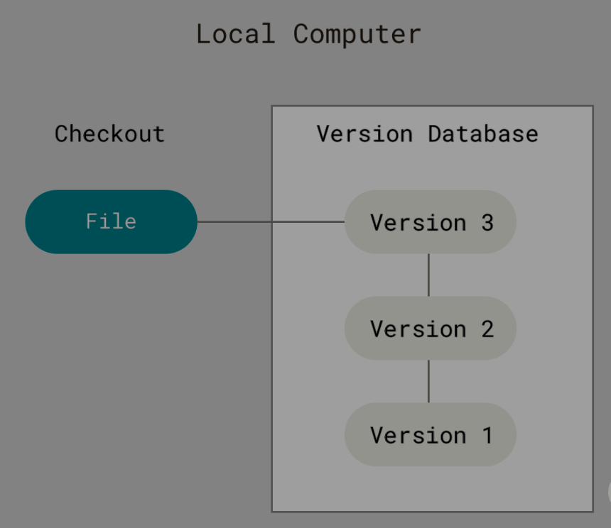

# How Does the Web Work?

#### Netwrok Switch  ( Switch  for short )

* it makes sure that messages sent from a given computer arrive only at their target destination computer.

#### Modem

* Turns the information from our network into information manageable by the telephone infrastructure and vice versa.
* The one that is hang on the wall with a little box

#### Router

* is a computer that knows how to forward messages between networks.
* The router is like a post office: when a packet arrives, it reads the recipient address and forwards the packet to the right recipient directly, without going through layers of relays.
* The box that usally place on the corner table of the sofa

#### ISP ( Internet Service Provider )

* a company that manages some special _routers_ that are all linked together and can also access other ISPs' routers.
* So the message from our network is carried through the network of ISP networks to the destination network.

***

## Finding Computers

**IP Adress (  Internet Protocol )**&#x20;

* It's an address made of a series of four numbers separated by dots, for example: `192.0.2.172`.

**Domain Name**

* An alias of IP address for Human Readable Name

***

## Internet and the web&#x20;

#### Internet&#x20;

* the Internet is a technical infrastructure which allows billions of computers to be connected all together.

#### Web

* is a service built on top of the infrastructure

***

## Intranets and Extranets

### Intranets&#x20;

* &#x20;are _private_ networks that are restricted to mem
* bers of a particular organization.

### Extranet&#x20;

* very similar to Intranets, except they open all or part of a private network to allow sharing and collaboration with other organizations.
* They are typically used to safely and securely share information with clients and stakeholders who work closely with a business.

<figure><figcaption></figcaption></figure>
