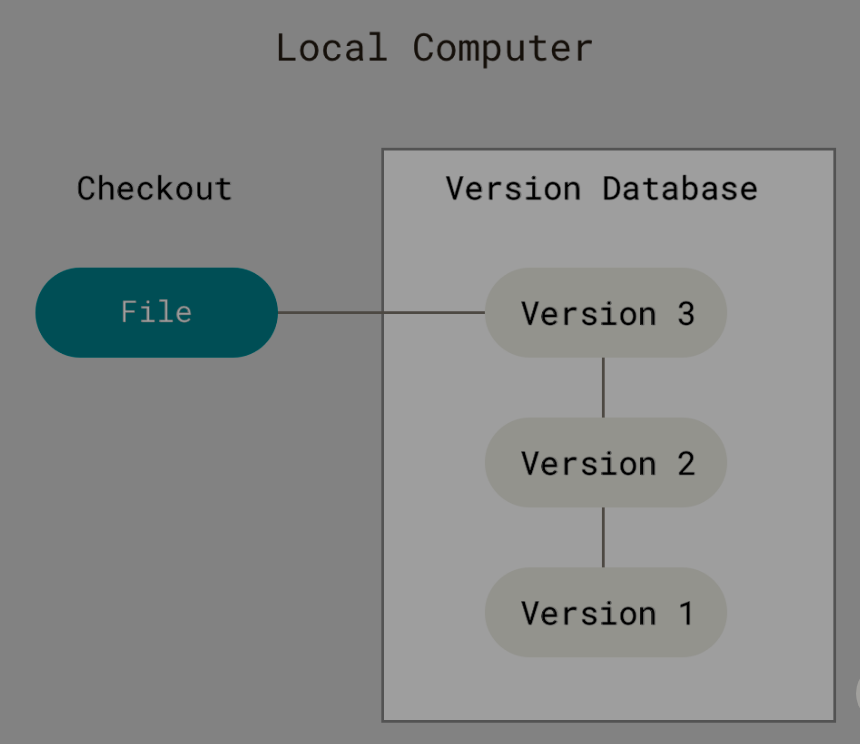

# Version Control System ( VCS)

### What is Version Control System ( VCS )?

* is a system that records changes to a file or set of files over time so that you can recall specific versions later.

### Local Version Contol Systems

*   ### Revision Control System (RCS)

    * is an early implementation of a VCS.
    * It is a set of [UNIX](https://en.wikipedia.org/wiki/Unix) commands that allow multiple users to develop and maintain program code or documents.
    * it can then re-create what any file looked like at any point in time by adding up all the patches.

    <figure><figcaption></figcaption></figure>

### Centralized Version Control Systems ( CVCSs )

* These systems (such as CVS, Subversion, and Perforce) have a single server that contains all the versioned files

<figure><figcaption></figcaption></figure>

* **Advantage**
  * everyone knows to a certain degree what everyone else on the project is doing.
  * Administrators have fine-grained control over who can do what, and it’s far easier to administer a CVCS than it is to deal with local databases on every client.
* **Downsides**
  * the single point of failure
    * If that server goes down for an hour, then during that hour nobody can collaborate at all or save versioned changes to anything they’re working.
  * If the hard disk the central database is on becomes corrupted, and proper backups haven’t been kept, you lose absolutely everything 

### Distributed Version Control System ( DVCSs )

* &#x20;such as Git, Mercurial or Darcs
* clients don’t just check out the latest snapshot of the files; rather, they fully mirror the repository, including its full history.

<figure><figcaption></figcaption></figure>

* his allows you to set up several types of workflows that aren’t possible in centralized systems, such as hierarchical models.

***

